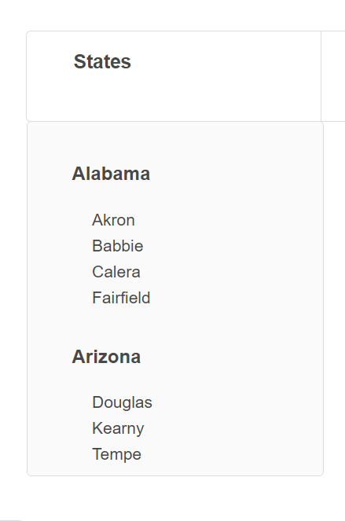

# AirBnB clone - Web framework

For this project we connect the storage engines with the html and we use the framework called flask also a web template engine for the Pytho programming language called jinja.

Everything stored in the engines will be displayed in the html according to the information required. The modification is required for the table of states, cities and amenities. The result of each section is shown below.

## for the states and cities section:

with the connection we made; a list of states and cities that we have in the database is displayed.

## for the amenities section

with the connection we made; a list of amenities that we have in the database is displayed.

## author

* Yerti Mariela Mosqueira Briceño * 